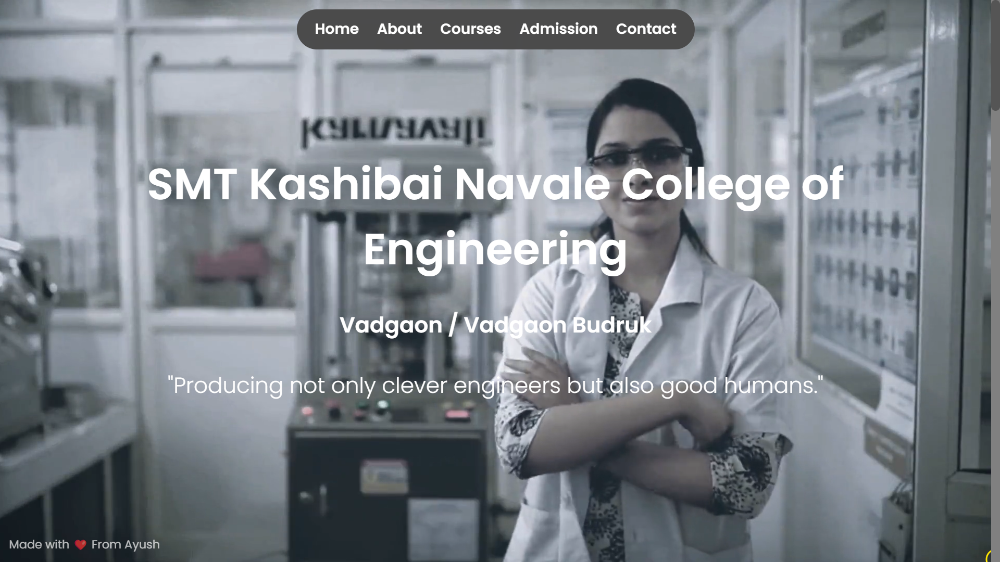
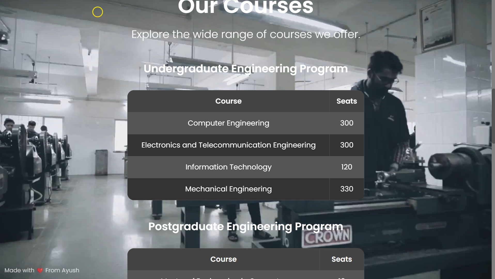

<!-- filepath: /C:/Users/sandi/Desktop/College website redesign/README.md -->
# College Website Redesign

This is a mini project to redesign a college website. The goal was to create a single scrolling webpage using HTML, CSS, and JavaScript, with a focus on minimal design and aesthetics.

## Features

- **Single Page Design**: All content is presented on a single, scrolling page.
- **Background Video**: A video background adds a dynamic and engaging visual element.
- **Custom Cursor**: A hollow yellow circle cursor enhances the user experience.
- **Dynamic Navigation Bar**: A navigation bar that hides and shows based on scroll direction.
- **Smooth Scrolling**: Smooth scrolling for navigation links for a seamless user experience.
- **Responsive Design**: The website is responsive and works well on different screen sizes.
- **Minimal Aesthetics**: Clean and minimal design for a modern look.

## Sections

1. **Home**: Introduction to the college.
2. **About**: Vision and mission of the college.
3. **Courses**: Information about undergraduate, postgraduate, and doctoral programs.
4. **Admission**: Details about the admission process with an "Enquire" button.
5. **Contact**: Contact information with a "Contact" button.

## Technologies Used

- **HTML**: For the structure of the webpage.
- **CSS**: For styling and layout.
- **JavaScript**: For interactivity and dynamic features.

## How to Use

1. Clone the repository:
    ```bash
    git clone https://github.com/ayushrajput2005/college-website.git
    ```
2. Navigate to the project directory:
    ```bash
    cd college-website-redesign
    ```
3. Open `index.html` in your web browser to view the website.

## Screenshots




## Acknowledgements

- Made with ❤️ from Ayush

Feel free to contribute to this project by submitting issues or pull requests.
